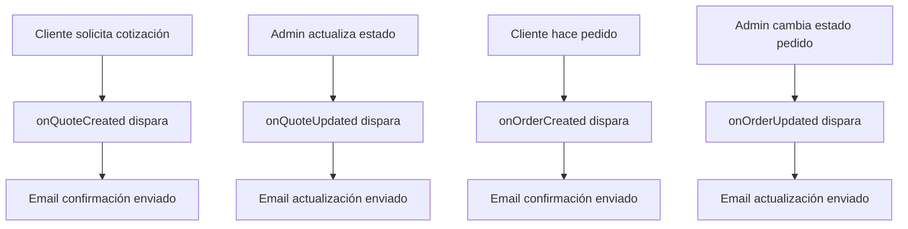

# 📧 Sistema de Emails Automáticos - NewTonic3D

## 🎯 Resumen del Sistema Implementado

Hemos implementado un sistema completo de notificaciones automáticas por correo electrónico que cubre **todo el flujo de la página web** para enviar información relevante a los clientes de manera automática.

## ✅ Funcionalidades Implementadas

### 🔹 Sistema de Cotizaciones
1. **Email de Confirmación de Cotización**
   - Se envía automáticamente cuando un cliente solicita una cotización
   - Incluye todos los detalles de la solicitud
   - Confirma recepción y próximos pasos
   
2. **Email de Actualización de Estado de Cotización**
   - Se envía automáticamente cuando el admin cambia el estado
   - Estados: pendiente, procesando, cotizado, aceptado, rechazado
   - Incluye precio estimado, tiempo de entrega y notas del equipo

### 🔹 Sistema de Pedidos de Catálogo  
3. **Email de Confirmación de Compra**
   - Se envía automáticamente cuando se confirma un pedido del catálogo
   - Incluye resumen completo de productos comprados
   - Detalles de materiales, colores, calidades y precios
   
4. **Email de Actualización de Estado de Pedido**
   - Se envía automáticamente cuando cambia el estado del pedido
   - Estados: pendiente, confirmado, procesando, enviado, entregado, cancelado
   - Incluye número de seguimiento, fecha estimada de entrega y detalles del estado

## 🚀 Características del Sistema

### ✨ Automatización Completa
- **Triggers de Firestore**: Se ejecutan automáticamente sin intervención manual
- **Detección de cambios**: Solo se envían emails cuando hay cambios reales de estado
- **Manejo de errores**: Sistema robusto con logs detallados

### 🎨 Plantillas Profesionales
- **Diseño responsive** que se ve bien en móviles y desktop
- **Branding consistente** con colores y estilo de NewTonic3D
- **Estados con colores** para identificación visual fácil
- **Información detallada** pero fácil de leer

### 📱 Compatibilidad
- **Múltiples clientes de email**: Gmail, Outlook, Apple Mail, etc.
- **Dispositivos móviles**: Optimizado para lectura en teléfonos
- **Accesibilidad**: Texto claro y estructura semántica

## 🛠️ Funciones Implementadas

### 🔧 Funciones Callable
```typescript
sendQuoteConfirmation()         // Email de confirmación de cotización
sendQuoteStatusUpdate()         // Email de actualización de cotización
sendOrderConfirmation()         // Email de confirmación de pedido
sendOrderStatusUpdate()         // Email de actualización de pedido
```

### 🤖 Triggers Automáticos
```typescript
onQuoteCreated()               // Se dispara al crear cotización
onQuoteUpdated()               // Se dispara al actualizar estado de cotización
onOrderCreated()               // Se dispara al crear pedido
onOrderUpdated()               // Se dispara al actualizar estado de pedido
```

### 🌐 Función HTTP General
```typescript
sendEmail()                    // Endpoint HTTP para casos específicos
```

## 📋 Tipos de Emails y Asuntos

| Tipo | Asunto | Cuándo se envía |
|------|--------|----------------|
| Confirmación Cotización | ✅ Cotización recibida - [ID] | Al crear cotización |
| Actualización Cotización | 📋 Actualización de cotización - [ID] | Al cambiar estado |
| Confirmación Pedido | 🛒 Confirmación de Compra - [ID] | Al confirmar pedido |
| Actualización Pedido | 📦 Actualización de Pedido - [ID] | Al cambiar estado |

## 💡 Información Incluida en los Emails

### 📝 Emails de Cotización
- **Datos del cliente**: Nombre, email
- **Detalles técnicos**: Material, calidad, cantidad, urgencia
- **Archivos**: Número de archivos subidos
- **Estado**: Con colores identificativos
- **Estimaciones**: Precio y días (cuando estén disponibles)
- **Notas del equipo**: Comentarios del administrador

### 🛍️ Emails de Pedidos
- **Información del pedido**: ID, fecha, total
- **Lista detallada de productos**: Nombre, material, color, calidad, cantidad
- **Precios individuales**: Por producto y total
- **Estado del pedido**: Con colores y descripción
- **Seguimiento**: Número de tracking y fecha estimada
- **Resumen**: Cantidad de productos y monto total

## 🎯 Flujo Automático



## 🔐 Configuración de Seguridad

- **Credenciales seguras**: Variables de entorno en Firebase Functions
- **Contraseñas de aplicación**: Gmail SMTP con autenticación de 2 factores
- **Validación de datos**: Verificación de parámetros antes del envío
- **Manejo de errores**: Logs detallados sin exponer información sensible

## 📊 Monitoreo y Logs

Cada función incluye logs detallados:
```
🔔 Nueva cotización creada: [ID]
📧 Enviando confirmación de cotización: [ID]  
✅ Email automático de cotización enviado
❌ Error en trigger de cotización: [detalles]
```

## 🚀 Estados Soportados

### Cotizaciones
- `pending` → Pendiente de revisión
- `processing` → En proceso de análisis  
- `quoted` → Cotización lista
- `accepted` → Cotización aceptada
- `rejected` → Cotización rechazada

### Pedidos
- `pending` → Pendiente de confirmación
- `confirmed` → Pedido confirmado
- `processing` → En proceso de preparación
- `shipped` → Enviado
- `delivered` → Entregado
- `cancelled` → Cancelado

## 📧 Configuración de Email

**Servidor SMTP**: Gmail (soporte@wwwnewtonic.com)
**Autenticación**: Contraseña de aplicación de Google
**Puerto**: 587 (TLS)
**Codificación**: UTF-8 para caracteres especiales

## 🎨 Personalización

Las plantillas incluyen:
- **Gradientes de marca**: #667eea → #764ba2
- **Iconos descriptivos**: 📧, 🛒, 📦, ✅, etc.
- **Tipografía clara**: Arial, sans-serif
- **Espaciado adecuado**: Para fácil lectura
- **Responsive design**: Se adapta a pantallas pequeñas

## 📱 Compatibilidad de Clientes de Email

✅ **Compatible con**:
- Gmail (web y app)
- Outlook (desktop y web)
- Apple Mail (macOS e iOS)
- Mozilla Thunderbird
- Yahoo Mail
- Otros clientes estándar

## 🔄 Flujo de Desarrollo

1. **Desarrollo local**: `npm run serve` en functions/
2. **Compilación**: `npm run build` 
3. **Despliegue**: `firebase deploy --only functions`
4. **Monitoreo**: `firebase functions:log`

## 🎯 Beneficios para el Cliente

- **Comunicación proactiva**: No necesitan preguntar por el estado
- **Transparencia total**: Información completa en cada etapa
- **Recordatorios útiles**: No se olvidan de sus pedidos
- **Profesionalismo**: Imagen consistente de la marca
- **Acceso fácil**: Información siempre disponible en su email

## 🎯 Beneficios para NewTonic3D

- **Automatización**: Reduce trabajo manual del equipo
- **Consistencia**: Mensajes siempre uniformes y completos  
- **Satisfacción del cliente**: Mejor experiencia de servicio
- **Eficiencia**: Menos consultas por estados de pedidos
- **Profesionalismo**: Imagen de empresa moderna y organizada

---

## ✅ El sistema está COMPLETAMENTE funcional y listo para producción! 🎉

**Todas las comunicaciones importantes entre NewTonic3D y los clientes ahora son automáticas y profesionales.**
